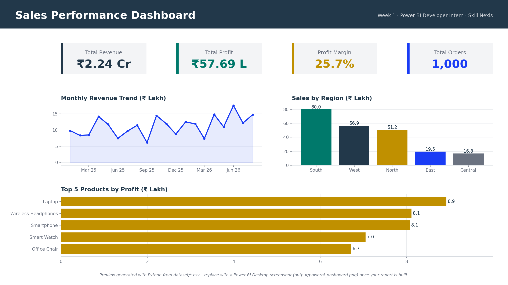
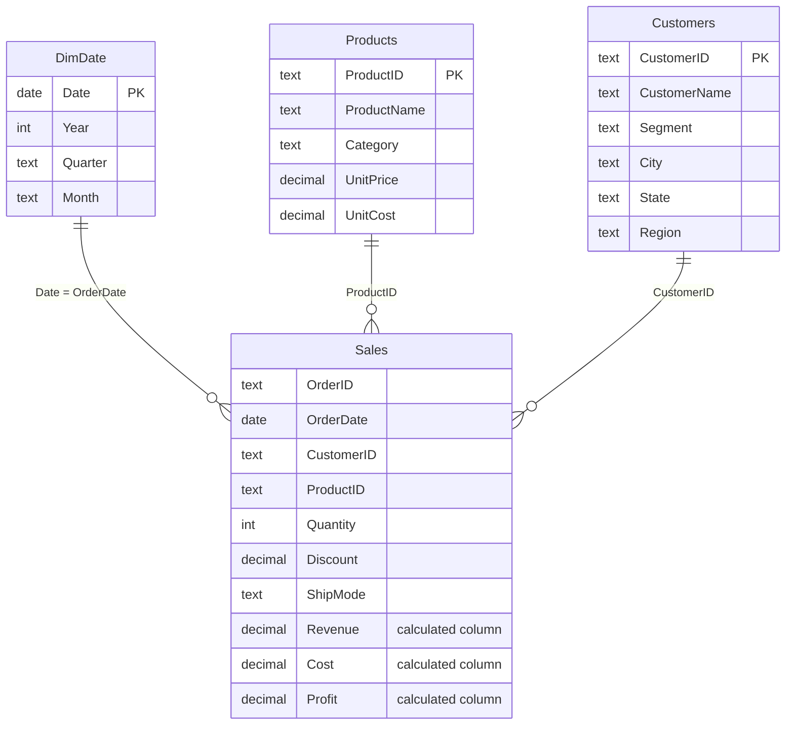

# Week 1 – Introduction to Power BI & Data Modelling
### Project: Sales Performance Dashboard



---

## 👤 Author & Internship Details

| Field | Details |
|-------|---------|
| **Author** | Tharuna B S |
| **Internship ID** | `<ADD-YOUR-INTERNSHIP-ID-HERE>` |
| **Organization** | Skill Nexis (Kolkata, West Bengal) |
| **Domain** | Power BI Developer Intern (Online) |
| **Internship Period** | 04/09/2026 – 16/10/2026 |
| **Week** | Week 1 |
| **Date** | 21/09/2026 |

---

## 🎯 Objective

Build a simple sales dashboard in Power BI that shows:

1. **Total Revenue**
2. **Sales by Region**
3. **Top 5 Products by Profit**

## 📚 Week 1 Topics Covered

- Overview of the Power BI interface and components
- Importing data from Excel / CSV / SQL Server
- Data transformation using Power Query (cleaning, filtering, merging)
- Understanding relationships and data models
- Creating calculated columns and measures using DAX

---

## 📁 Folder Structure

```
Week1_Project/
├── README.md                          ← this file
├── requirements.txt                   ← tools & Python packages
├── dataset/
│   ├── sales.csv                      ← fact table  (1,008 rows incl. 8 duplicates)
│   ├── products.csv                   ← dimension   (12 products)
│   ├── customers.csv                  ← dimension   (60 customers)
│   └── sales_data.xlsx                ← same 3 tables as Excel sheets
├── source_code/
│   ├── power_query.m                  ← Power Query (M) cleaning steps
│   ├── dax_measures.dax               ← calculated columns, calendar table, measures
│   ├── generate_dataset.py            ← script that created the dataset
│   └── generate_dashboard_preview.py  ← Python cross-check + preview image
└── output/
    └── dashboard_preview.png          ← dashboard image
```

---

## 🗂️ Dataset

The instructor's sample file link was not available offline, so a realistic **retail sales dataset (India, Jan 2025 – Aug 2026)** was created with `source_code/generate_dataset.py`.
Amounts are in **Indian Rupees (₹)**.

| Table | Rows | Key columns |
|-------|------|-------------|
| `sales` | 1,008 raw (1,000 after cleaning) | OrderID, OrderDate, CustomerID, ProductID, Quantity, Discount, ShipMode |
| `products` | 12 | ProductID, ProductName, Category, UnitPrice, UnitCost |
| `customers` | 60 | CustomerID, CustomerName, Segment, City, State, Region |

> **Intentional data-quality issues** (to practise Power Query): 8 duplicate order rows in `sales`, and inconsistent `Region` text in `customers` (`" West "`, `SOUTH`, `central`).

> **Using the instructor's file instead?** Load it the same way, then adjust the column names in `dax_measures.dax` if they differ.

---

## 🔗 Data Model (Star Schema)



All relationships are **one-to-many**, **single direction** (dimension → fact).

---

## 🛠️ Steps Followed

### 1. Import
`Home → Get data → Text/CSV` → load `sales.csv`, `products.csv`, `customers.csv` (or `sales_data.xlsx`).

### 2. Transform (Power Query)
Full M code in [`source_code/power_query.m`](source_code/power_query.m).

| Table | Transformation |
|-------|----------------|
| Sales | Promote headers · set data types · remove blank rows · **remove duplicates** · trim text |
| Products | Set data types (currency for price / cost) · de-duplicate on ProductID |
| Customers | **Trim + Capitalize Each Word** on `Region` · de-duplicate on CustomerID |
| Optional | Merge Sales + Products + Customers into a single flat table |

### 3. Model
In **Model view**, create the three relationships shown above and mark `DimDate` as a date table.

### 4. DAX
Full code in [`source_code/dax_measures.dax`](source_code/dax_measures.dax).

```DAX
Revenue = Sales[Quantity] * RELATED ( Products[UnitPrice] ) * ( 1 - Sales[Discount] )   -- calculated column
Cost    = Sales[Quantity] * RELATED ( Products[UnitCost] )                               -- calculated column
Profit  = Sales[Revenue] - Sales[Cost]                                                   -- calculated column

Total Revenue   = SUM ( Sales[Revenue] )                                                  -- measure
Total Profit    = [Total Revenue] - SUM ( Sales[Cost] )                                   -- measure
Profit Margin % = DIVIDE ( [Total Profit], [Total Revenue] )                              -- measure
```

### 5. Visuals

| Requirement | Visual | Fields |
|-------------|--------|--------|
| Total Revenue | **Card** | `[Total Revenue]` |
| Sales by Region | **Clustered column chart** | Axis: `Customers[Region]` · Values: `[Total Revenue]` |
| Top 5 Products by Profit | **Bar chart** | Axis: `Products[ProductName]` · Values: `[Total Profit]` · Filter: **Top N = 5 by `[Total Profit]`** |
| Extras | Cards for Profit, Margin %, Orders · Line chart of monthly revenue · Slicers for Year / Category | – |

---

## 📊 Output


<!-- After building your report in Power BI Desktop, save a screenshot as
     output/powerbi_dashboard.png and uncomment the line below:

-->

### Key figures (after cleaning)

| Metric | Value |
|--------|-------|
| Total Revenue | **₹2,24,27,050** (₹2.24 Cr) |
| Total Profit | ₹57,69,240 |
| Profit Margin | 25.72 % |
| Total Orders | 1,000 |

**Sales by Region**

| Region | Revenue (₹) | Share |
|--------|------------:|------:|
| South | 79,96,220 | 35.7 % |
| West | 56,87,723 | 25.4 % |
| North | 51,16,730 | 22.8 % |
| East | 19,50,623 | 8.7 % |
| Central | 16,75,755 | 7.5 % |

**Top 5 Products by Profit**

| # | Product | Profit (₹) |
|---|---------|-----------:|
| 1 | Laptop | 8,92,250 |
| 2 | Wireless Headphones | 8,10,975 |
| 3 | Smartphone | 8,07,200 |
| 4 | Smart Watch | 7,04,750 |
| 5 | Office Chair | 6,71,575 |

### Insights

- The **South** region generates the most revenue (≈ 36 %), while **East** and **Central** together contribute only ~16 %, so they are the biggest growth opportunity.
- **Laptop** earns the highest profit through its high unit margin, but low-priced **Wireless Headphones** are almost equal because they sell in volume.
- The overall **profit margin is about 26 %**; discounting is the main lever to protect it.

---

## ▶️ How to Reproduce

**In Power BI Desktop (main deliverable)**
1. Open Power BI Desktop → *Transform data* → create the `FolderPath` parameter and paste the queries from `source_code/power_query.m`.
2. *Close & Apply*, build relationships, then add the columns / measures from `source_code/dax_measures.dax`.
3. Build the visuals listed above and save as `Sales_Dashboard.pbix`.

**Optional Python cross-check**
```bash
pip install -r requirements.txt
cd source_code
python generate_dataset.py            # re-creates dataset/*.csv and sales_data.xlsx
python generate_dashboard_preview.py  # prints KPIs and re-creates output/dashboard_preview.png
```
The KPI numbers printed by the script should match the Power BI cards exactly.

---

## ✅ Learning Outcomes

- Navigated the Power BI Desktop interface (Report, Data, Model views, Power Query Editor).
- Imported and cleaned data from CSV / Excel with Power Query.
- Designed a star-schema model with one-to-many relationships.
- Wrote DAX calculated columns and measures (`SUM`, `RELATED`, `DIVIDE`, `RANKX`, `TOTALYTD`).
- Built an interactive dashboard answering three business questions.

---

*Prepared by **Tharuna B S** · Power BI Developer Intern · Skill Nexis*
