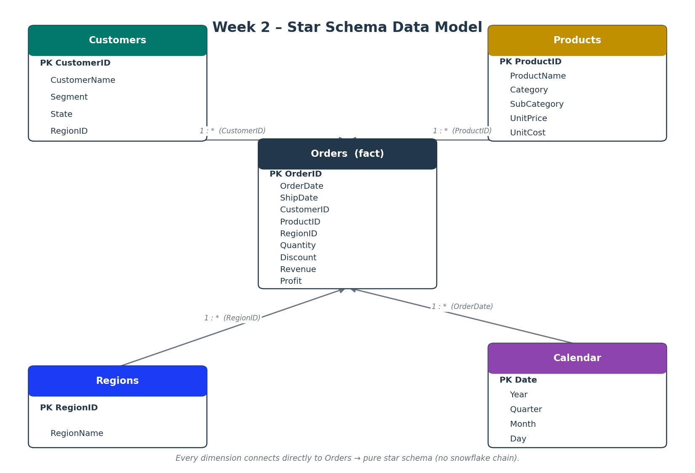
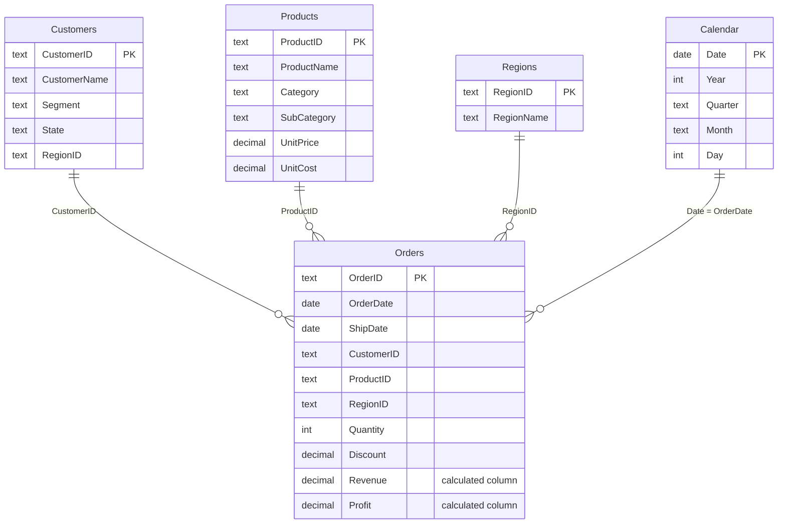

# Week 2 – Data Modeling & Relationships
### Project: Star-Schema Model for Superstore-style Order Data



---

## 👤 Author & Internship Details

| Field | Details |
|-------|---------|
| **Author** | Tharuna B S |
| **Internship ID** | `<ADD-YOUR-INTERNSHIP-ID-HERE>` |
| **Organization** | Skill Nexis (Kolkata, West Bengal) |
| **Domain** | Power BI Developer Intern (Online) |
| **Internship Period** | 04/09/2026 – 16/10/2026 |
| **Week** | Week 2 |
| **Date** | 21/09/2026 |

---

## 🎯 Objective

- Create relationships between **Orders → Customers**, **Orders → Products**, **Orders → Regions**.
- Create a **Calendar table using DAX** and build a **Year → Month → Day** date hierarchy.
- Verify all relationships in **Model view**.

## 📚 Week 2 Topics Covered

- Data Model Views
- Relationships (One-to-Many, Many-to-One)
- Date Table Creation (Calendar Table)
- Star & Snowflake Schema
- Data Validation

---

## 📁 Folder Structure

```
Week2_Project/
├── README.md                          ← this file
├── requirements.txt                   ← tools & Python packages
├── dataset/
│   ├── orders.csv                     ← fact table  (1,202 rows incl. planted issues)
│   ├── customers.csv                  ← dimension   (80 customers)
│   ├── products.csv                   ← dimension   (12 products)
│   ├── regions.csv                    ← dimension   (5 regions)
│   └── superstore_data.xlsx           ← same 4 tables as Excel sheets
├── source_code/
│   ├── power_query.m                  ← Power Query (M) import + cleaning + validation flag
│   ├── dax_measures.dax               ← Calendar table, hierarchy, relationships, validation measures
│   ├── generate_dataset.py            ← script that created the dataset
│   └── generate_model_diagram.py      ← Python validation report + model diagram image
└── output/
    ├── model_diagram.png              ← star-schema diagram
    └── validation_report.txt          ← data-validation results
```

---

## 🗂️ Dataset

The assignment links to the **Kaggle Superstore dataset**, which needs a free Kaggle login to download. Since that login isn't available in this environment, `source_code/generate_dataset.py` builds an **equivalent Superstore-style dataset offline** — same shape and column intent, ready to import straight into Power BI. Amounts are in **Indian Rupees (₹)**.

| Table | Rows | Key columns |
|-------|------|-------------|
| `orders` | 1,202 raw (1,200 after de-dup) | OrderID, OrderDate, ShipDate, **CustomerID**, **ProductID**, **RegionID**, Quantity, Discount, ShipMode |
| `customers` | 80 | CustomerID, CustomerName, Segment, State, RegionID |
| `products` | 12 | ProductID, ProductName, Category, SubCategory, UnitPrice, UnitCost |
| `regions` | 5 | RegionID, RegionName |

> **If you have Kaggle access**, download the real Superstore CSV instead and point `power_query.m`'s `FolderPath` at it — you'll likely need to split its single flat file into Customers/Products/Regions dimension tables yourself, or just add the relationships directly on the flat file's ID columns (Order ID, Customer ID, Product ID, Region already exist as columns in the Kaggle version).

> **Intentional data-quality issues** (Data Validation topic): 2 duplicate order rows, 4 orders where `ShipDate` is before `OrderDate` (physically impossible), and 1 order referencing a `ProductID` (`PRD-999`) that does not exist in `products.csv` (an orphan key — it would silently vanish from any visual sliced by Product).

---

## 🔗 Data Model (Star Schema)



This is a **pure star schema**: every dimension (Customers, Products, Regions, Calendar) connects **directly** to the single fact table, Orders — there's no dimension-to-dimension chain, which is what would make it a **snowflake schema** instead (e.g. if `Regions` connected to `Customers` and *then* to `Orders`, rather than straight to `Orders`).

All four relationships are **one-to-many**, **single-direction** filter flow (dimension → fact), and all four can stay **active** at once because each points from a different fact-table column.

---

## 🛠️ Steps Followed

### 1. Import
`Home → Get data → Text/CSV` → load `orders.csv`, `customers.csv`, `products.csv`, `regions.csv` (or `superstore_data.xlsx`).

### 2. Transform (Power Query)
Full M code in [`source_code/power_query.m`](source_code/power_query.m).

| Table | Transformation |
|-------|----------------|
| Orders | Set data types (dates, currency-ready numbers) · remove blank rows · **remove duplicates** · trim text · add `IsValidShipDate` flag column |
| Customers | Set data types · de-duplicate on CustomerID |
| Products | Currency types for price/cost · de-duplicate on ProductID |
| Regions | De-duplicate on RegionID |

### 3. Model (Model view)
Drag to create the three relationships from the assignment, plus Calendar → Orders:

- `Customers[CustomerID]` → `Orders[CustomerID]`
- `Products[ProductID]` → `Orders[ProductID]`
- `Regions[RegionID]` → `Orders[RegionID]`
- `Calendar[Date]` → `Orders[OrderDate]`

Then mark `Calendar` as the official **date table** (right-click table → *Mark as date table* → column `Date`).

### 4. Calendar table + hierarchy (DAX)
Full code in [`source_code/dax_measures.dax`](source_code/dax_measures.dax).

```DAX
Calendar = CALENDAR ( MIN ( Orders[OrderDate] ), MAX ( Orders[OrderDate] ) )   -- exactly as given in the assignment

Year        = YEAR ( 'Calendar'[Date] )
MonthNumber = MONTH ( 'Calendar'[Date] )       -- hidden helper, used only to sort Month correctly
Month       = FORMAT ( 'Calendar'[Date], "MMMM" )
Day         = DAY ( 'Calendar'[Date] )
```

Then, in the Fields pane: right-click `Year` → **Create Hierarchy** → drag in `Month`, then `Day` → **Year → Month → Day**. Sort `Month` by `MonthNumber` so it reads Jan–Dec instead of alphabetically.

### 5. Data validation
Full code in `dax_measures.dax`. These measures should each read **0** (or **TRUE**) once the model is clean — any other value means a relationship or a source row needs fixing:

```DAX
Invalid Ship Dates          -- COUNT of Orders shipped before they were placed        → 0 (real data: 4 planted)
Orders Missing Product Match -- COUNT of Orders whose ProductID isn't in Products     → 0 (real data: 1 planted)
All Customers Matched       -- TRUE if every Orders[CustomerID] exists in Customers   → TRUE
All Regions Matched         -- TRUE if every Orders[RegionID] exists in Regions       → TRUE
```

In this project's sample data, `Invalid Ship Dates` correctly returns **4** and `Orders Missing Product Match` returns **1** — proving the validation logic actually works, since those rows were planted on purpose. Fix them by correcting the source row or filtering it out in Power Query before it reaches the model.

---

## 📊 Output

**Star-schema diagram** (stand-in for a Model view screenshot):


<!-- After building the model in Power BI Desktop, save a screenshot of
     Model view as output/powerbi_model_view.png and uncomment below:

-->

**Validation report** — see [`output/validation_report.txt`](output/validation_report.txt):

```
Orders rows (raw)               : 1202
Orders rows (after de-dup)      : 1200
Duplicate rows removed          : 2

[Invalid Ship Dates]   ShipDate < OrderDate : 4 row(s)
[Orphan ProductID]     Orders -> Products   : 1 row(s)  (ORD-21200 -> PRD-999)
[Orphan CustomerID]    Orders -> Customers  : 0 row(s)
[Orphan RegionID]      Orders -> Regions    : 0 row(s)
```

---

## ▶️ How to Reproduce

**In Power BI Desktop (main deliverable)**
1. Open Power BI Desktop → *Transform data* → create the `FolderPath` parameter and paste the queries from `source_code/power_query.m`.
2. *Close & Apply* → go to **Model view** → drag the four relationships listed above.
3. Add the Calendar table and calculated columns from `source_code/dax_measures.dax`, mark it as the date table, and build the Year → Month → Day hierarchy.
4. Add the validation measures and drop them on a card or table visual to confirm the model is clean.
5. Save as `Week2_Model.pbix`.

**Optional Python cross-check**
```bash
pip install -r requirements.txt
cd source_code
python generate_dataset.py           # re-creates dataset/*.csv and superstore_data.xlsx
python generate_model_diagram.py     # prints the validation report and re-creates output/model_diagram.png
```
The validation counts printed by the script should match the DAX validation measures exactly.

---

## ✅ Learning Outcomes

- Distinguished **Report / Data / Model views** and worked in Model view specifically to build relationships.
- Built **one-to-many relationships** between a fact table and three dimension tables.
- Created a **Calendar table with `CALENDAR()`** and a **Year → Month → Day** date hierarchy.
- Understood the difference between a **star schema** (all dimensions connect directly to the fact table) and a **snowflake schema** (dimensions chain through each other).
- Wrote DAX **data-validation measures** (`EXCEPT`, `TREATAS`, `FILTER`, `CALCULATE`) to catch orphan keys and impossible dates before trusting a report built on the model.

---

*Prepared by **Tharuna B S** · Power BI Developer Intern · Skill Nexis*
